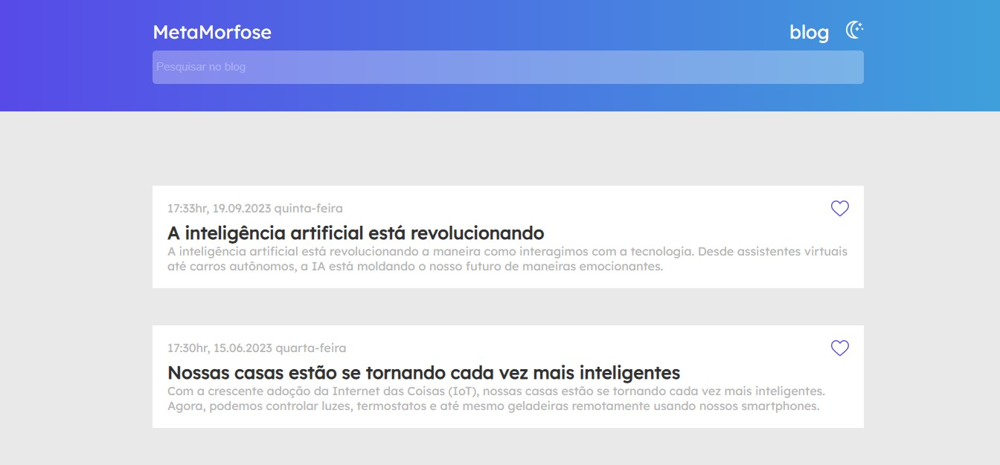
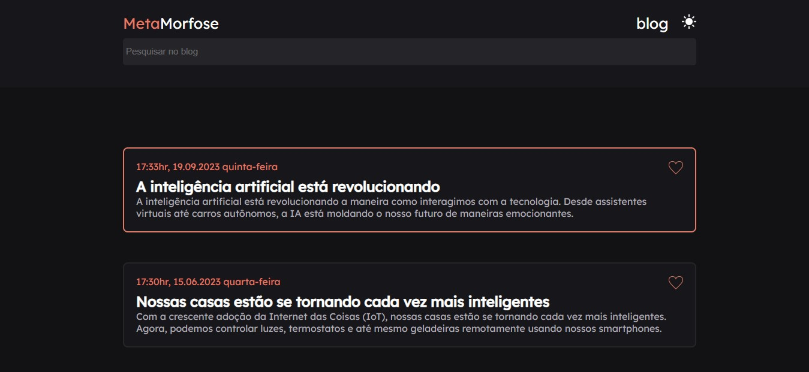

# Blog - Desafio Codelândia

Este é um projeto desenvolvido para o desafio da comunidade Codelândia. O objetivo do desafio era de recriar a interface proposta no figma do criador do desafio, um simples de um blog 
utilizando HTML e CSS, e implementar a funcionalidade de troca de tema entre dark e light.
 

  
       
  

 

## Funcionalidades

- Interface de blog simples com layout responsivo.
- Troca de tema entre light e dark.
- Exibição de postagens (fictícias).
